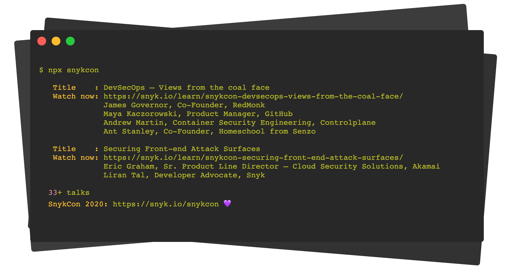

<p align="center"><h1 align="center">
  snykcon
</h1>

<p align="center">
  A CLI for Snyk's SnykCon 2020 DevSecOps and Developer-first security conference
</p>

<p align="center">
  <a href="https://www.npmjs.org/package/snykcon"></a>
  <a href="https://snyk.io/snykcon"></a>
</p>

<p align="center">
  
</p>


# About

`snykcon` is a CLI for Snyk's SnykCon 2020 DevSecOps and Developer-first security conference that prints out a list of all the talks, their speakers and a link to watch them online.

# Usage

Browse all SnykCon 2020 sessions using npx:

```shell
$ npx snykcon
```

# Contributing

Please consult [CONTRIBUTING](./CONTRIBUTING.md) for guidelines on contributing to this project.

# Author

**is-website-vulnerable** © [Liran Tal](https://github.com/lirantal), Released under the [Apache-2.0](./LICENSE) License.
